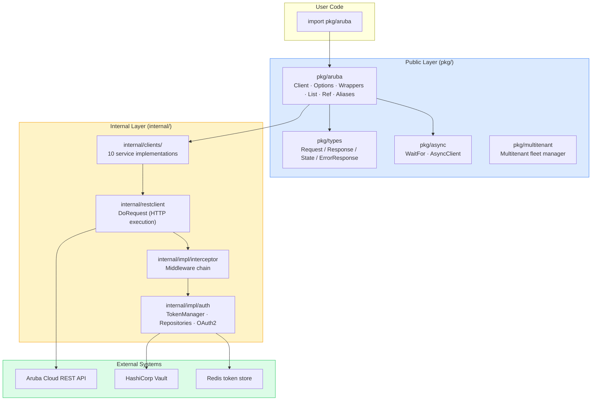
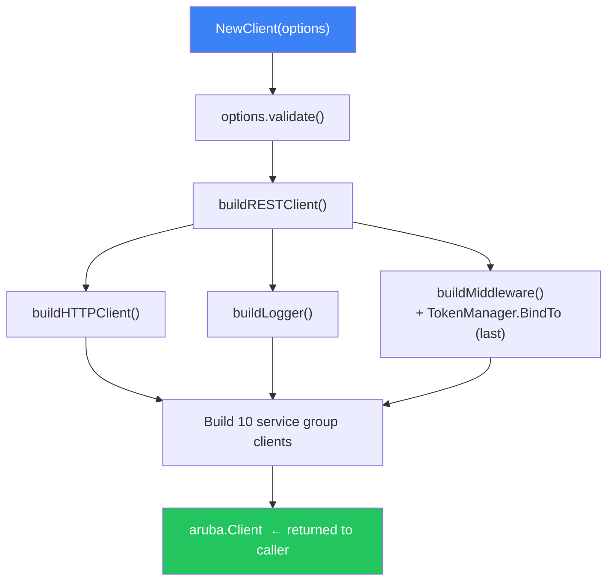
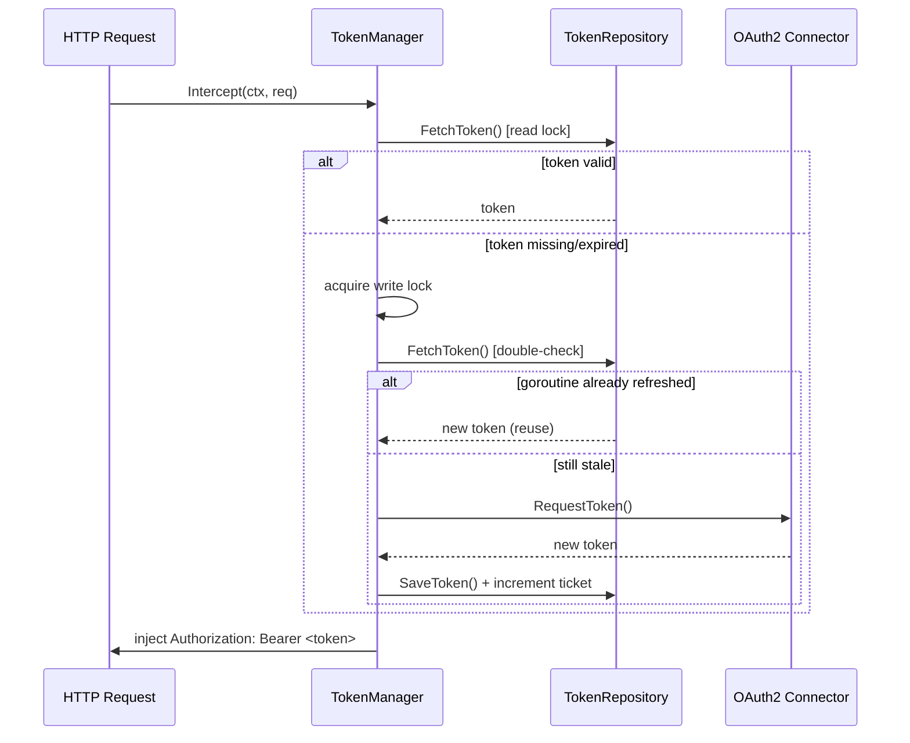
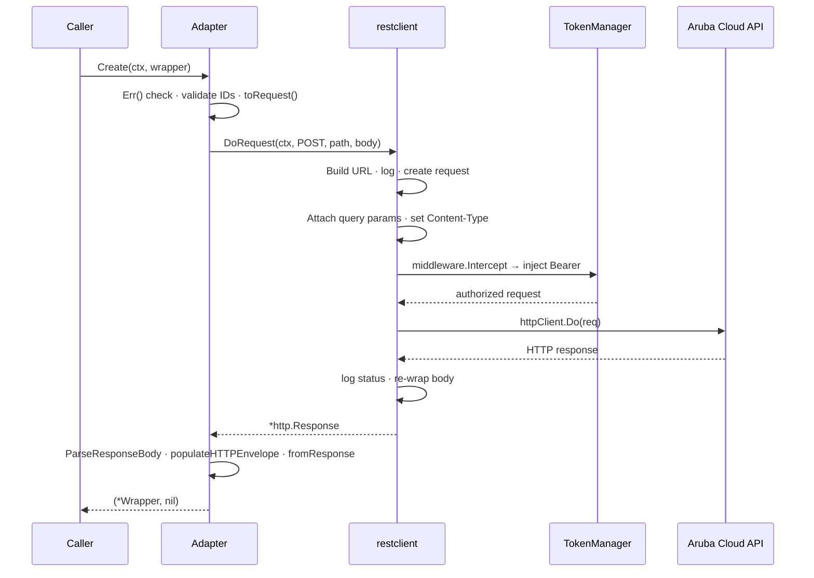
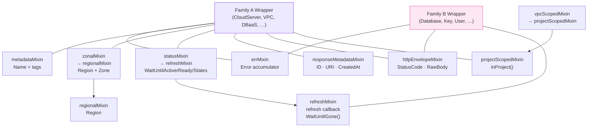
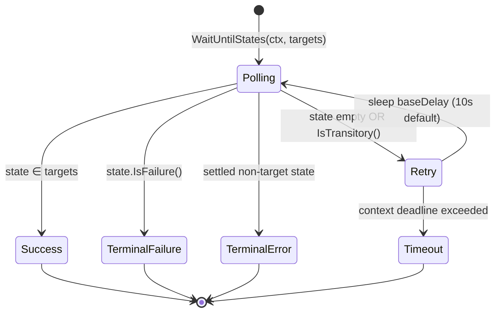
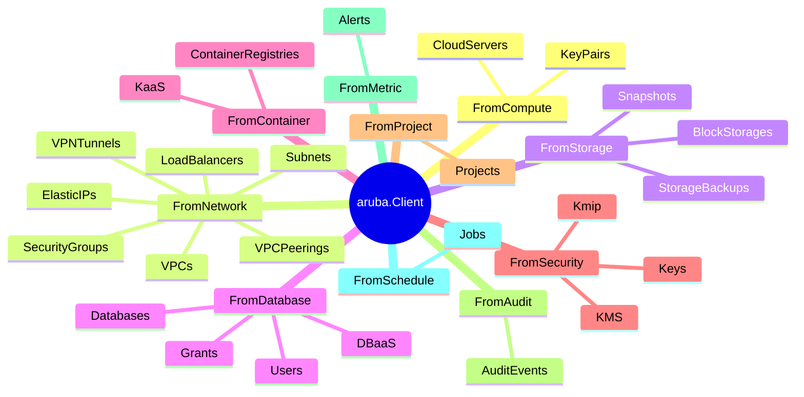
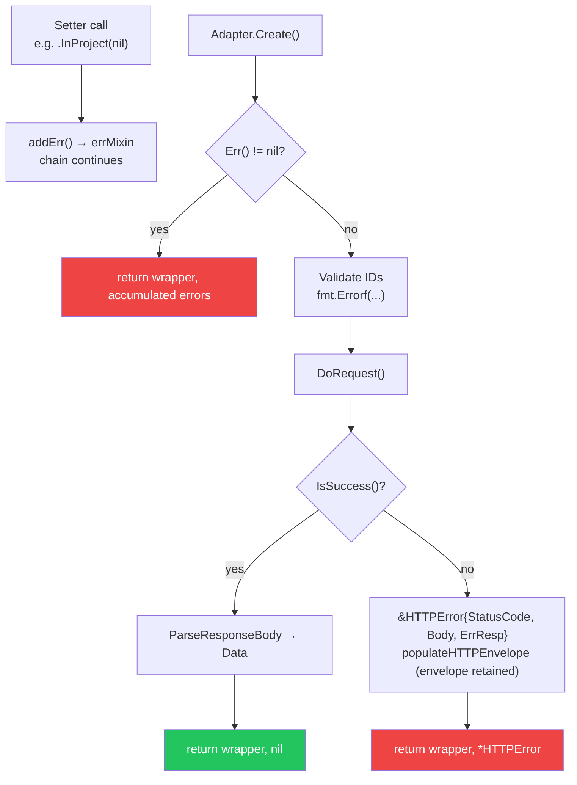

# SDK Architecture Diagrams — Quick Reference

All diagrams use [Mermaid](https://mermaid.js.org/) syntax. Render in GitHub, VS Code (Mermaid extension), or [mermaid.live](https://mermaid.live).

---

## D1 — Layered Architecture Overview



---

## D2 — Client Construction Flow



---

## D3 — OAuth2 Token Injection (Double-Checked Locking)



---

## D4 — HTTP Request Lifecycle



---

## D5 — Wrapper Triplet Pattern

```mermaid
graph LR
    subgraph File["resource_cloud_server.go"]
        W["WRAPPER\nfluent builder + mixins\nNewCloudServer().Named().InProject()…"]
        I["LOW-LEVEL INTERFACE\ncloudServersLowLevelClient\n(mockable contract)"]
        AD["ADAPTER\nbridges wrapper ↔ internal/clients"]
    end

    W -->|toRequest()| AD
    AD -->|fromResponse()| W
    AD --> I --> IMPL["internal/clients/compute\ncloudServersClientImpl"]

    style W fill:#dbeafe,stroke:#3b82f6
    style I fill:#fef3c7,stroke:#f59e0b
    style AD fill:#dcfce7,stroke:#22c55e
```

---

## D6 — Mixin Composition



---

## D7 — Async Polling State Machine



---

## D8 — Service Group Map



---

## D9 — Multi-Tenant Fleet

```mermaid
graph TD
    TMPL["Template Options\n(shallow-copied singletons:\n*http.Client · logger · middleware)"]
    MT["Multitenant\nmap[tenantID → {client, lastUsage}]"]

    TMPL -->|NewWithTemplate| MT

    MT -->|New('tenant-a')| CA["aruba.Client\ntenant-a"]
    MT -->|New('tenant-b')| CB["aruba.Client\ntenant-b"]
    MT -->|New('tenant-c')| CC["aruba.Client\ntenant-c"]

    CLEAN["StartCleanupRoutine\ntick: 1h · idle threshold: 24h"]
    CLEAN -->|CleanUp()| MT

    style MT fill:#dbeafe,stroke:#3b82f6
    style CLEAN fill:#fef3c7,stroke:#f59e0b
```

---

## D10 — Error Handling Flow


