# Aruba Cloud Go SDK — Architecture & Capabilities
**Technical Presentation** · June 2026

---

## Table of Contents

1. [What is the SDK?](#1-what-is-the-sdk)
2. [High-Level Architecture](#2-high-level-architecture)
3. [Package Structure](#3-package-structure)
4. [Single-Import Design Principle](#4-single-import-design-principle)
5. [Client Construction](#5-client-construction)
6. [Authentication Subsystem](#6-authentication-subsystem)
7. [HTTP Request Lifecycle](#7-http-request-lifecycle)
8. [Service Groups](#8-service-groups)
9. [Wrapper Layer — Triplet Pattern](#9-wrapper-layer--triplet-pattern)
10. [Mixin System](#10-mixin-system)
11. [Resource Families: A vs. B](#11-resource-families-a-vs-b)
12. [Async Polling & Wait Helpers](#12-async-polling--wait-helpers)
13. [Multi-Tenant Client Management](#13-multi-tenant-client-management)
14. [Key Design Highlights](#14-key-design-highlights)

---

## 1. What is the SDK?

The **Aruba Cloud Go SDK** (`github.com/Arubacloud/sdk-go`) is the official Go client library for the Aruba Cloud API.

| Attribute | Value |
|---|---|
| Language | Go 1.24+ |
| Module | `github.com/Arubacloud/sdk-go` |
| Status | Alpha (API surface may change) |
| Auth | OAuth2 Client Credentials (RFC 6749) |
| Service Groups | 10 (Compute, Network, Storage, Database, Container, Security, Project, Audit, Metrics, Schedule) |
| Wire Format | JSON / REST |

### Core Value Proposition

- **Single-import ergonomics** — `import "github.com/Arubacloud/sdk-go/pkg/aruba"` covers 99.9% of use cases
- **Fluent, chainable builders** — resource construction reads like plain English
- **Built-in async polling** — `WaitUntilActive()`, `WaitUntilReady()`, `WaitUntilStates()` included on every resource
- **Multi-tenant ready** — `pkg/multitenant` manages fleets of per-tenant clients out of the box
- **Extensible auth** — supports static tokens, OAuth2 client credentials, memory/file/Redis/Vault backends

---

## 2. High-Level Architecture

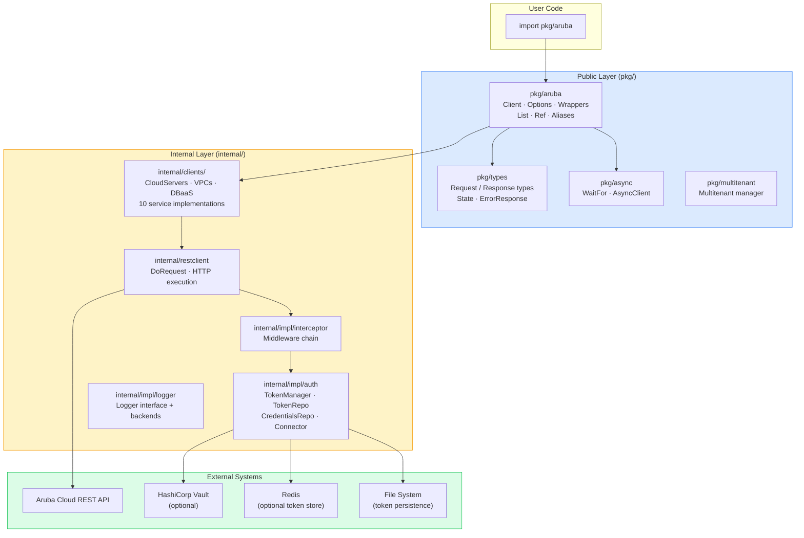

---

## 3. Package Structure

```
sdk-go/
├── pkg/
│   ├── aruba/              ← Public entry point & wrapper layer
│   │   ├── aruba.go        ← NewClient() + Options
│   │   ├── builder.go      ← buildClient() orchestration
│   │   ├── resource_*.go   ← Fluent wrappers + adapters (one per resource)
│   │   ├── mixin_common.go ← errMixin, metadataMixin, httpEnvelopeMixin, …
│   │   ├── mixin_scoped.go ← projectScopedMixin, vpcScopedMixin, …
│   │   ├── mixin_status.go ← statusMixin: WaitUntilActive/Ready/States
│   │   ├── list.go         ← Generic List[T] paginated container
│   │   ├── aliases.go      ← Typed enum constants re-exported from pkg/types
│   │   ├── ref.go          ← Ref interface, extractID, parseURIIDs
│   │   └── errors.go       ← *HTTPError
│   ├── types/              ← All request/response/common data models
│   ├── async/              ← WaitFor, AsyncClient, polling primitives
│   └── multitenant/        ← Multi-tenant client manager
│
├── internal/
│   ├── clients/            ← Service-specific HTTP client impls
│   │   ├── compute/        ← Cloud servers, key pairs
│   │   ├── network/        ← VPCs, subnets, security groups, …
│   │   ├── storage/        ← Block storage, snapshots, backups
│   │   ├── database/       ← DBaaS, databases, users, grants
│   │   ├── container/      ← KaaS, node pools, registries
│   │   ├── security/       ← KMS, keys, KMIP
│   │   ├── project/        ← Projects
│   │   ├── audit/          ← Audit events
│   │   ├── metric/         ← Metrics & alerts
│   │   └── schedule/       ← Scheduled jobs
│   ├── restclient/         ← Low-level HTTP execution (DoRequest)
│   └── impl/
│       ├── auth/           ← Token manager, repositories, OAuth2 connector
│       ├── interceptor/    ← Middleware chain
│       └── logger/         ← Logger interface + backends
│
├── examples/all-resources/ ← Usage examples (canonical builder chains)
└── docs/website/           ← Docusaurus documentation site
```

---

## 4. Single-Import Design Principle

The fundamental contract: **one import covers 99.9% of real-world usage**.

```go
import "github.com/Arubacloud/sdk-go/pkg/aruba"

client, _ := aruba.NewClient(aruba.NewOptions().
    WithClientCredentials("my-id", "my-secret").
    WithBaseURL("https://api.aruba.cloud"))

cs := aruba.NewCloudServer().
    OfFlavor(aruba.CloudServerFlavorSmall).
    Named("web-01").
    Tagged("prod", "web").
    InProject(projectRef).
    InRegion(aruba.RegionItaly).
    BilledBy(aruba.BillingPeriodHour)

result, err := client.FromCompute().CloudServers().Create(ctx, cs)
```

Three mechanisms enforce this principle:

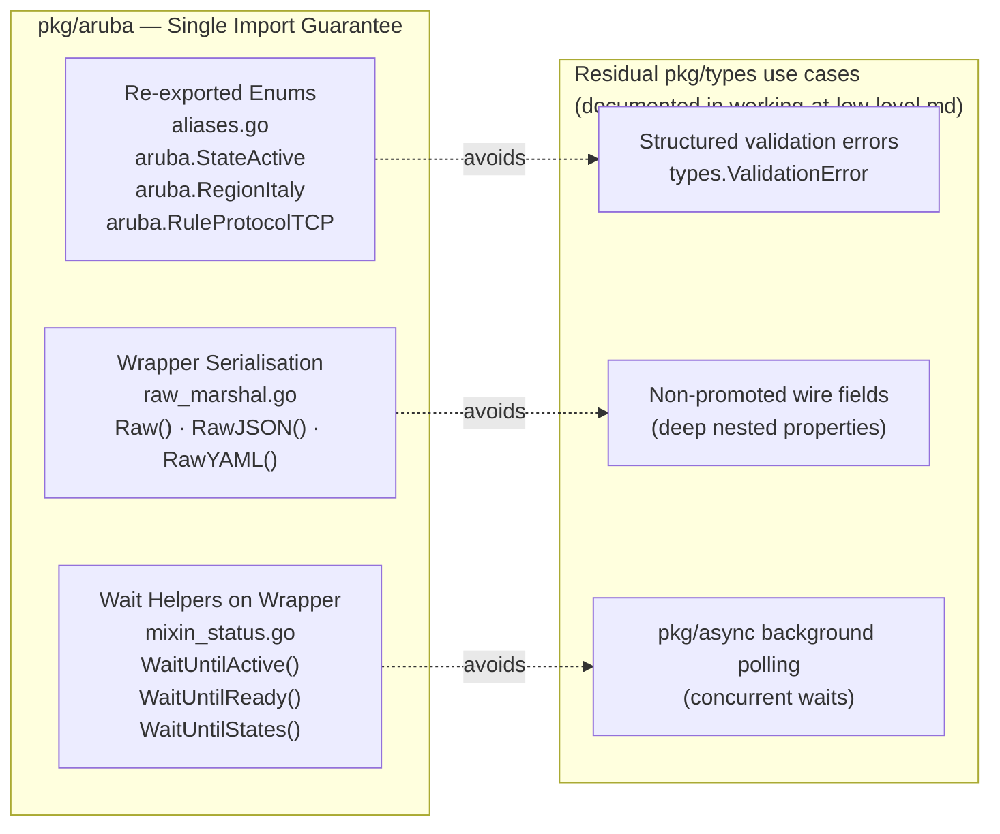

---

## 5. Client Construction

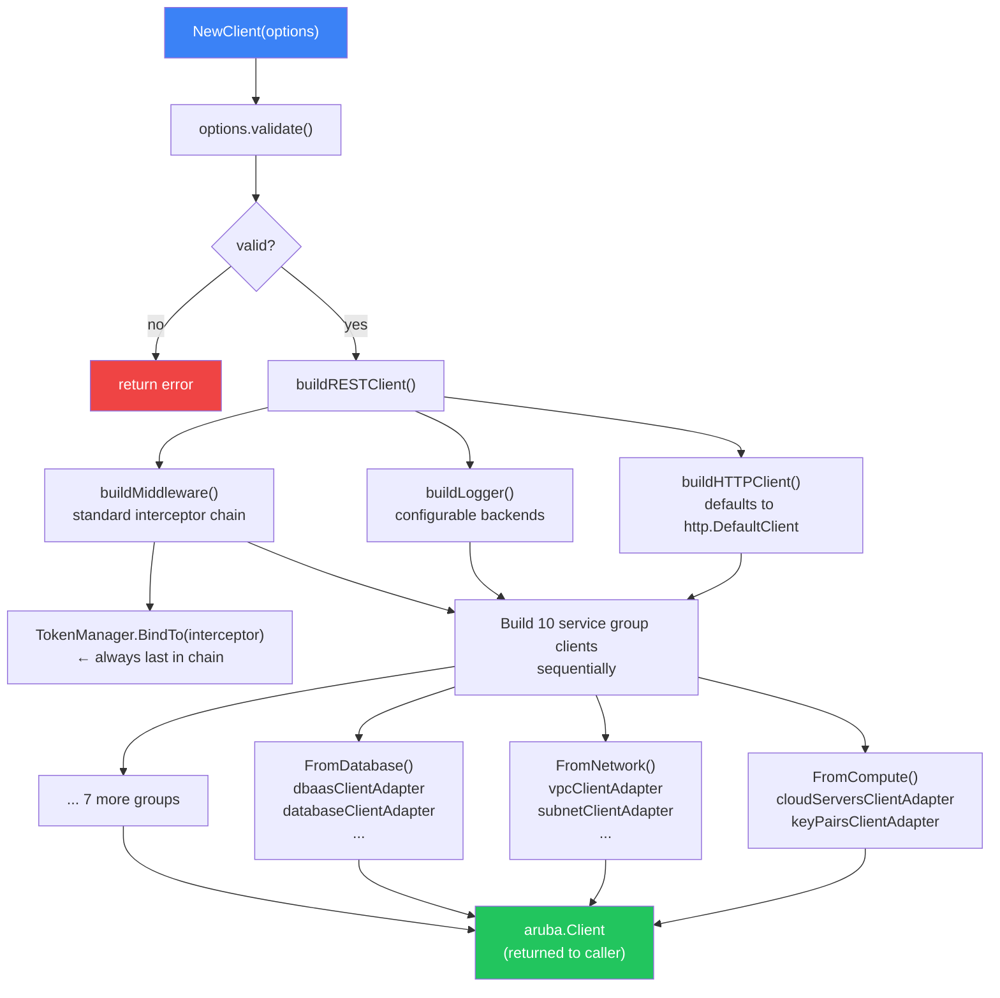

**Key injection points via `Options`:**

| Option | Default | Purpose |
|---|---|---|
| `WithCustomHTTPClient(*http.Client)` | `http.DefaultClient` | Custom transport, timeouts, TLS |
| `WithClientCredentials(id, secret)` | — | OAuth2 auto-refresh |
| `WithToken(token)` | — | Static bearer token |
| `WithCustomMiddleware(interceptor)` | `standard.NewInterceptor()` | Custom request hooks |
| `WithCustomLogger(logger)` | no-op | Structured logging |

---

## 6. Authentication Subsystem

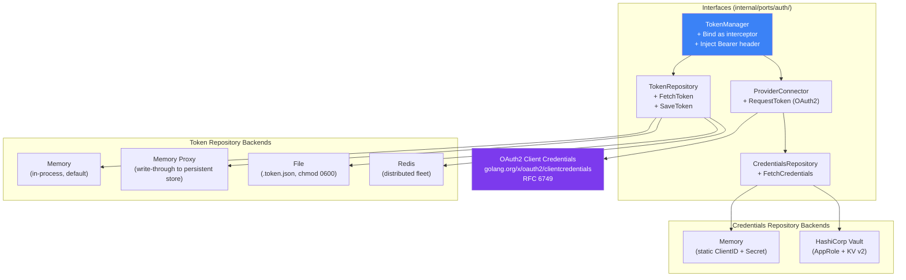

**Token Injection — Double-Checked Locking:**

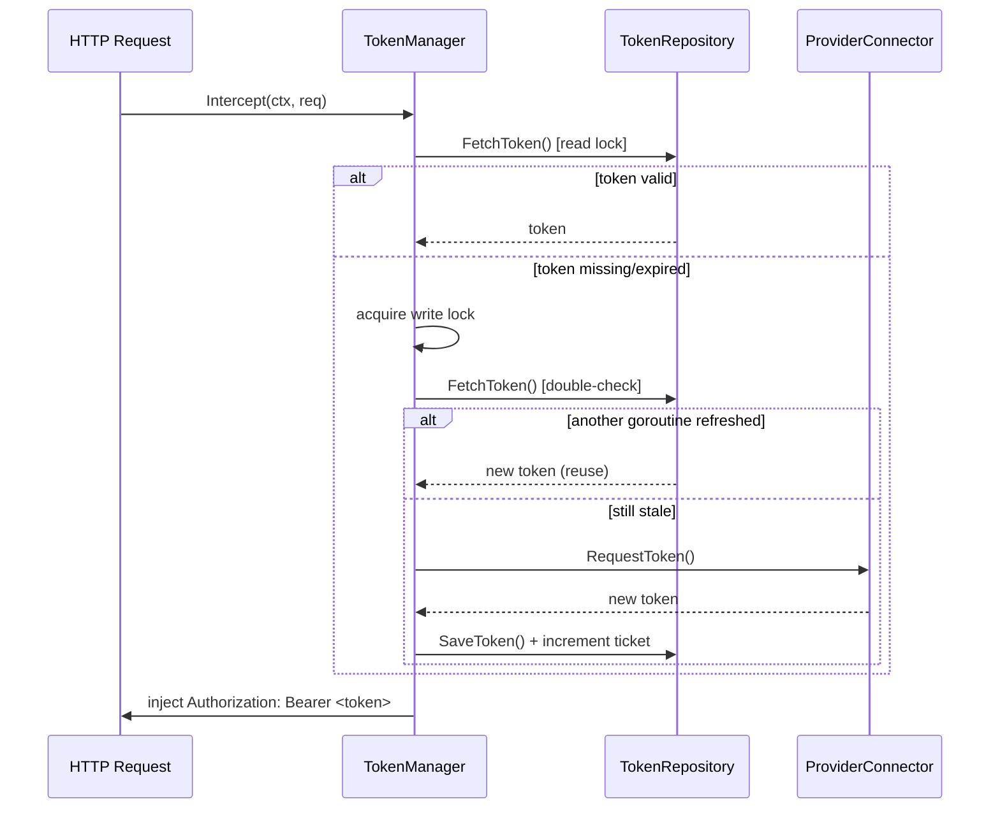

> **Fleet safety:** `NewTokenProxyWithRandomExpirationDriftSeconds` randomises the expiry drift to prevent synchronised token-refresh storms across multiple SDK instances.

---

## 7. HTTP Request Lifecycle

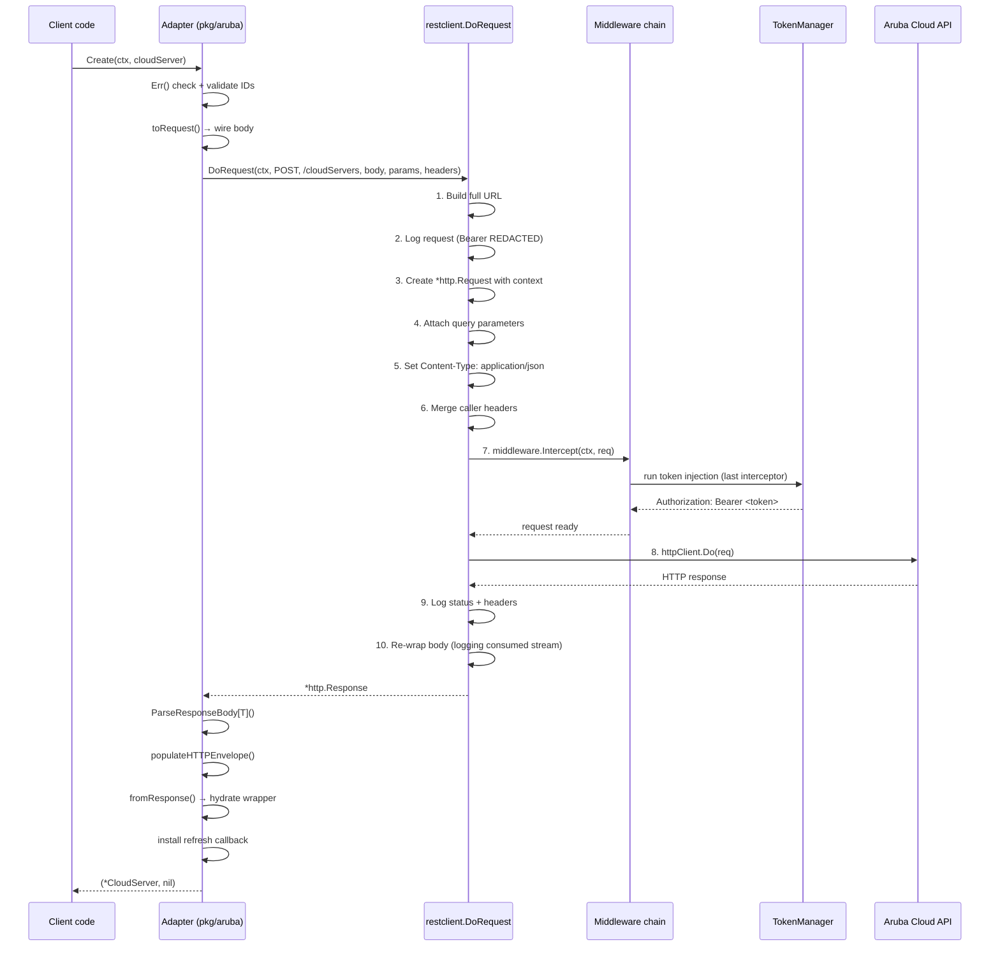

---

## 8. Service Groups

The root `Client` exposes **10 service group accessors**:

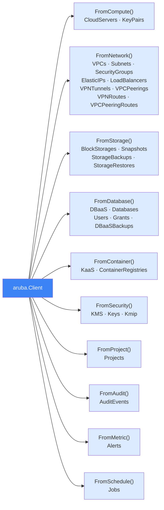

**Call chain anatomy:**

```
arubaClient.FromCompute().CloudServers().Create(ctx, cs)
     │              │           │           │
     │              │           │           └─ ctx + fluent wrapper
     │              │           └─ CloudServersClient interface
     │              └─ ComputeClient interface
     └─ root aruba.Client
                                    ↓
                        cloudServersClientAdapter.Create()
                                    ↓
                        compute.NewCloudServersClientImpl(rest).Create()
```

---

## 9. Wrapper Layer — Triplet Pattern

Every `resource_<name>.go` follows a strict **three-section layout**:

```mermaid
graph LR
    subgraph TripletFile["resource_cloud_server.go"]
        W["WRAPPER\nChainable builder struct\n+ mixin embeds\n+ typed setters\n+ read accessors\n\nNewCloudServer()\n.Named() .InProject()\n.OfFlavor() .InRegion()\n.BilledBy() …"]
        I["LOW-LEVEL INTERFACE\nAdapter contract\n(mockable in tests)\n\ncloudServersLowLevelClient {\n  List(ctx, params)\n  Create(ctx, req)\n  Get(ctx, id, params)\n  Update(ctx, id, req)\n  Delete(ctx, id)\n}"]
        AD["ADAPTER\nBridges wrapper ↔\ninternal/clients/*\n\ncloudServersClientAdapter\n.Create() .Get()\n.Update() .Delete()\n.List()"]
    end

    W -->|toRequest()| AD
    AD -->|fromResponse()| W
    AD -->|calls| I
    I -->|implemented by| IMPL["internal/clients/compute\ncloudServersClientImpl"]

    style W fill:#dbeafe,stroke:#3b82f6
    style I fill:#fef3c7,stroke:#f59e0b
    style AD fill:#dcfce7,stroke:#22c55e
```

**Fluent builder — setter verb vocabulary:**

| Verb | Role | Example |
|---|---|---|
| `New<X>()` | Construct | `NewCloudServer()` |
| `Named(name)` | Identity | `.Named("web-01")` |
| `Tagged(…)` | Labels | `.Tagged("prod", "web")` |
| `In<Parent/Geo>` | Containment & placement | `.InProject(ref)`, `.InRegion(aruba.RegionItaly)` |
| `Of<Classifier>` | Type / sizing | `.OfFlavor(...)`, `.OfEngine(...)` |
| `From<Source>` | Origin | `.FromImage(ref)`, `.FromVolume(ref)` |
| `With<Noun>` | Attached config | `.WithVPC(ref)`, `.WithElasticIP(ref)` |
| `BilledBy(period)` | Billing | `.BilledBy(aruba.BillingPeriodHour)` |

---

## 10. Mixin System

Mixins are embedded structs providing reusable behaviour across all wrappers.

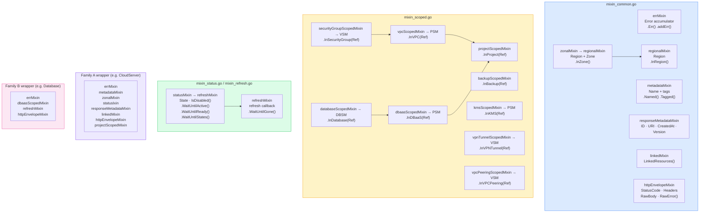

---

## 11. Resource Families: A vs. B

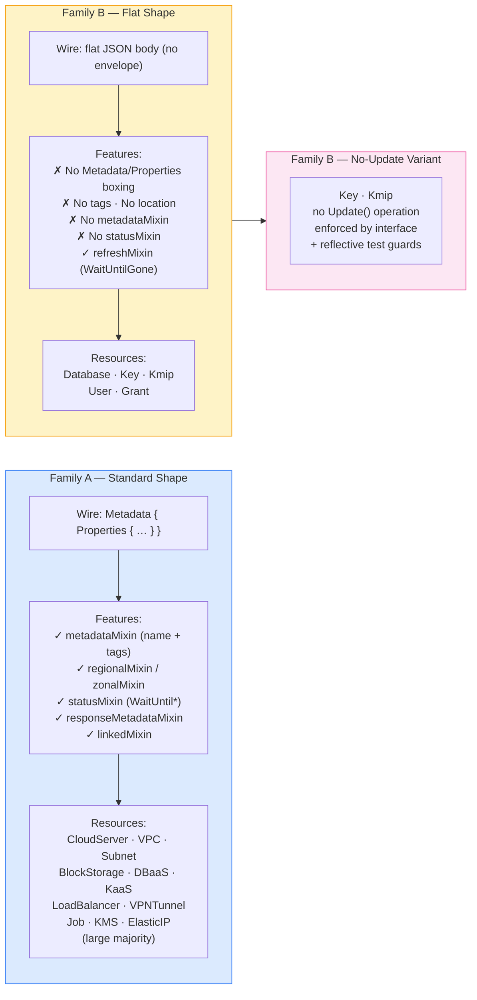

**Identity quirks in Family B:**

| Resource | ID field | URI construction |
|---|---|---|
| `Database` | name IS the path identifier | client-side: `ancestor-ids + name` |
| `Key` | `KeyResponse.KeyID` | client-side from ancestor IDs |
| `Kmip` | `KmipResponse.ID` | client-side from ancestor IDs |
| `User` | `WithUsername(...)` | name IS path identifier |
| `Grant` | opaque server grant ID | recoverable from URI Ref only |

---

## 12. Async Polling & Wait Helpers

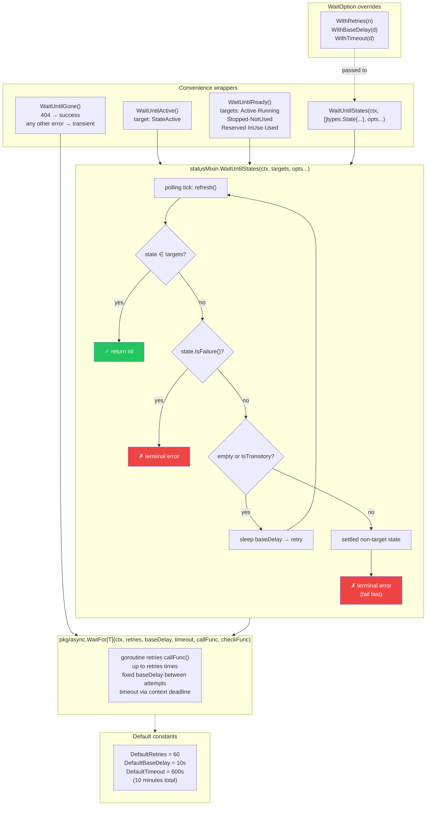

**Specialised waiters for edge cases:**

| Waiter | Resource | Trigger |
|---|---|---|
| `WaitUntilCertificateAvailable` | `*Kmip` | Polls `KmipResponse.Status` against explicit terminal map |
| `WaitUntilUsed` / `WaitUntilNotUsed` | `*BlockStorage`, `*ElasticIP` | Attach/detach lifecycle |

---

## 13. Multi-Tenant Client Management

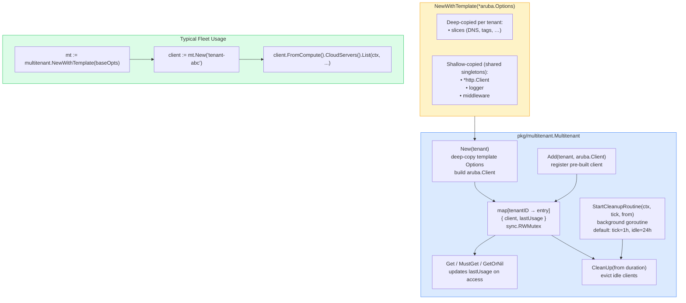

---

## 14. Key Design Highlights

### Design Decisions Summary

| Decision | Rationale |
|---|---|
| **Single public entry point** (`pkg/aruba`) | Eliminates import sprawl; callers rarely need internal packages |
| **Triplet pattern** (Wrapper / Interface / Adapter) | Testability — adapter tested via mock; wrapper tested independently |
| **Mixin composition over inheritance** | Go doesn't have inheritance; mixins compose cleanly and stay independent |
| **Fluent chainable builders** | Readable intent; error accumulation means broken chains don't panic |
| **Double-checked locking in token manager** | Goroutine-safe refresh without serialising every request |
| **Fixed-delay polling** (no exponential backoff) | Predictable behaviour; Aruba API operations have known durations |
| **Family A / Family B split** | Enforces wire-shape discipline; prevents accidental cross-family code reuse |
| **`Ref` interface** (`URI() + ID()`) | Decouples adapters from typed wrappers; enables `aruba.URI("/...")` escape hatch |
| **Response-preferring getters** | `Get → display` works without re-setting fields; server data always wins |
| **`fromResponse` round-trip invariant** | `Get → toRequest() → PUT` roundtrip preserves all server-side fields |

### Error Handling Model

```
Setter-time errors   → accumulated in errMixin (never panic, chain continues)
                         checked at adapter entry: if err := X.Err(); err != nil { return X, err }

Validation errors    → returned as Go error values (pre-HTTP)
                         fmt.Errorf("project cannot be empty")

API errors (4xx/5xx) → unmarshaled into resp.Error (*types.ErrorResponse, RFC 7807)
                         returned as *HTTPError; wrapper retains envelope for diagnostics

Network errors       → surfaced from httpClient.Do(); no special wrapping
```

### Compile-Time Safety

- All enums are **typed strings** (`type State string`, `type Region string`) — no raw string magic
- All enum constants are re-exported in `aliases.go` under the `aruba.*` namespace
- Family B "no-Update" contract enforced by both **service-group interface** definition and **reflective test guards**
- Deep parent chains validated at adapter entry, not silently dropped on the wire

---

*Generated June 2026 · `github.com/Arubacloud/sdk-go`*
